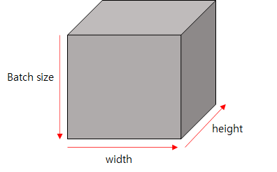

# Vector Matrix Tensor

- 2D Tensor

    $|t| = (batch size, dim)$

- 3D Tensor (Typical computer vision)
$|t| = (batch size, width, height)$



NLP에서 생각해보면 width * height 사각형이 하나의 문장이라고 생각하고 그 문장이 batch size만큼 존재한다고 생각하면 된다.

---

# [Pytorch_basic](https://github.com/xcvdv/deeplearning-basicstudy/blob/main/PART1/pytorch_basic.ipynb)

PyTorch는 numpy와 매우 유사하고 호환성도 높다.

```python
import torch

t = torch.FloatTensor([[0., 1., 2.,],[ 3., 4., 5.],[ 6.,7.,8.,]])

print(t.dim())
print(t.shape)
print(t.size())
```

dim은 numpy ndim와 같다. numpy에서 size는 전체 원소의 개수였지만 pytorch의 size는 shape와 같은 결과가 나온다. 슬라이싱은 numpy와 같다.

---

### 행렬 곱

numpy에서 행렬곱은 @연산자 혹은 dot()함수를 사용하였다. pytorch에서는 matmul()함수를 사용한다. * 혹은 mul()은 numpy처럼 element-wise 연산으로 곱셈이 수행된다.

```python
import torch

m1 = torch.FloatTensor([[0., 1., 2.,],[ 3., 4., 5.],[ 6.,7.,8.,]])
m2 = torch.FloatTensor([[0,1],[2,3],[3,4]])
m1.matmul(m2) # 행렬곱

```

---

### Mean

mean()함수를 사용해 평균을 구할 수 있는데 longTensor에서는 제대로 수행되지 않는다. dim은 numpy의 axis와 같은 역할을 한다.

```python
t = torch.FloatTensor([[1,2],[3,4]])
t.mean()
t.mean(dim=0) # 0번축 기준으로 mean계산
t.mean(dim=1) # 1번축 기준으로 mean계산
t.mean(dim=-1) # 마지막 축 기준으로 mean계산
```

---

### view

view 함수는 numpy의 reshape함수와 같은 역할을 한다. 

---

### squeeze

squeeze는 원소 개수가 하나인 차원을 제거해준다.

```python
import torch

f = torch.FloatTensor([[1],[2],[3]])
print(f.shape)
f = f.squeeze()
print(f)
print(f.shape)
```

squeeze(dim=3)과 같이 dimension을 명시해주면 해당 dimension의 원소 개수가 1일경우 없어지고 아닌 경우 아무런 변화가 일어나지 않음

---

### unsqueeze

원하는 dimension에 1을 넣어준다. squeeze와 다르게 dimension을 반드시 명시해줘야 한다.

```python
import torch

f = torch.FloatTensor([1,2,3])
print(f.shape)
f1 = f.unsqueeze(0)
print(f1.shape)
print(f1)
print(f2.shape)
print(f2)
```

---

### 형변환

```python
import torch

a = torch.LongTensor([1,2,3,4,5])
b = torch.ByteTensor([True, False])
print(a.float().type())
print(b.float().type())
print(a.byte().type())
print(b.long().type())
```

---

### concatenate

numpy의 concatenate와 똑같다. `torch.cat([x,y,], dim=0)` 과 같이 사용한다.

---

### stack

stack함수는 parameter로 tensor의 리스트를 받는다.

```python
import torch

x = torch.FloatTensor([1,2])
y = torch.FloatTensor([3,4])
z = torch.FloatTensor([5,6])

print(torch.stack([x,y,z]))
print(torch.stack([x,y,z], dim=1))
```

만약 위의 코드를 concatenate로 하려면 x,y,z를 unsqueeze를 사용한 뒤 concatenate해야한다.

---

### like함수

numpy와 마찬가지로 `torch.ones_like(tensor), torch.zeros_like(tensor)` 처럼 사용하면 tensor과 똑같은 모양의 배열을 만들고 각각 1과 0으로 채워준다. 같은 device에 있어야 (cpu면 cpu gpu면 같은gpu... 다를경우 error) 계산이 정상적으로 작동한다. like함수는 같은 device에 할당된다.

---

### in-place operation

underscore를 사용해 원본 배열을 연산 결과로 변경해준다. 새로 메모리 할당하지 않고 연산 결과를 사용할 수 있다. 속도 면에서 이득을 볼것 같지만 pytorch의 GC가 효율적으로 잘 구현되어 있어서 속도상의 이점은 별로 없다고 한다.

```python
import torch

x = torch.FloatTensor([[1,2],[3,4,]])
x.mul(2) # 원본 x는 변화 없이 결과 반환만 됨
print(x)
x.mul_(2) # 원본 x자체가 변함
print(x)
```

---
