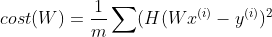
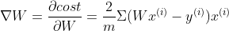
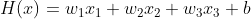
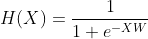
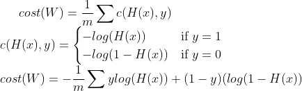
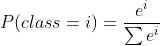
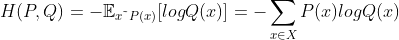
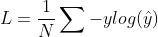

# Vector Matrix Tensor

- 2D Tensor

    `|t| = (batch size, dim)`

- 3D Tensor (Typical computer vision)

    `|t| = (batch size, width, height)`


NLP에서 생각해보면 width * height 사각형이 하나의 문장이라고 생각하고 그 문장이 batch size만큼 존재한다고 생각하면 된다.

---
# [Pytorch_basic](https://github.com/xcvdv/deeplearning-basicstudy/blob/main/PART1/pytorch_basic.ipynb)

PyTorch는 numpy와 매우 유사하고 호환성도 높다.

```python
import torch

t = torch.FloatTensor([[0., 1., 2.,],[ 3., 4., 5.],[ 6.,7.,8.,]])

print(t.dim())
print(t.shape)
print(t.size())
```

dim은 numpy ndim와 같다. numpy에서 size는 전체 원소의 개수였지만 pytorch의 size는 shape와 같은 결과가 나온다. 슬라이싱은 numpy와 같다.

---

### 행렬 곱

numpy에서 행렬곱은 @연산자 혹은 dot()함수를 사용하였다. pytorch에서는 matmul()함수를 사용한다. * 혹은 mul()은 numpy처럼 element-wise 연산으로 곱셈이 수행된다.

```python
import torch

m1 = torch.FloatTensor([[0., 1., 2.,],[ 3., 4., 5.],[ 6.,7.,8.,]])
m2 = torch.FloatTensor([[0,1],[2,3],[3,4]])
m1.matmul(m2) # 행렬곱

```

---

### Mean

mean()함수를 사용해 평균을 구할 수 있는데 longTensor에서는 제대로 수행되지 않는다. dim은 numpy의 axis와 같은 역할을 한다.

```python
t = torch.FloatTensor([[1,2],[3,4]])
t.mean()
t.mean(dim=0) # 0번축 기준으로 mean계산
t.mean(dim=1) # 1번축 기준으로 mean계산
t.mean(dim=-1) # 마지막 축 기준으로 mean계산
```

---

### view

view 함수는 numpy의 reshape함수와 같은 역할을 한다.

---

### squeeze

squeeze는 원소 개수가 하나인 차원을 제거해준다.

```python
import torch

f = torch.FloatTensor([[1],[2],[3]])
print(f.shape)
f = f.squeeze()
print(f)
print(f.shape)
```

squeeze(dim=3)과 같이 dimension을 명시해주면 해당 dimension의 원소 개수가 1일경우 없어지고 아닌 경우 아무런 변화가 일어나지 않음

---

### unsqueeze

원하는 dimension에 1을 넣어준다. squeeze와 다르게 dimension을 반드시 명시해줘야 한다.

```python
import torch

f = torch.FloatTensor([1,2,3])
print(f.shape)
f1 = f.unsqueeze(0)
print(f1.shape)
print(f1)
print(f2.shape)
print(f2)
```

---

### 형변환

```python
import torch

a = torch.LongTensor([1,2,3,4,5])
b = torch.ByteTensor([True, False])
print(a.float().type())
print(b.float().type())
print(a.byte().type())
print(b.long().type())
```

---

### concatenate

numpy의 concatenate와 똑같다. `torch.cat([x,y,], dim=0)` 과 같이 사용한다.

---

### stack

stack함수는 parameter로 tensor의 리스트를 받는다.

```python
import torch

x = torch.FloatTensor([1,2])
y = torch.FloatTensor([3,4])
z = torch.FloatTensor([5,6])

print(torch.stack([x,y,z]))
print(torch.stack([x,y,z], dim=1))
```

만약 위의 코드를 concatenate로 하려면 x,y,z를 unsqueeze를 사용한 뒤 concatenate해야한다.

---

### like함수

numpy와 마찬가지로 `torch.ones_like(tensor), torch.zeros_like(tensor)` 처럼 사용하면 tensor과 똑같은 모양의 배열을 만들고 각각 1과 0으로 채워준다. 같은 device에 있어야 (cpu면 cpu gpu면 같은gpu... 다를경우 error) 계산이 정상적으로 작동한다. like함수는 같은 device에 할당된다.

---

### in-place operation

underscore를 사용해 원본 배열을 연산 결과로 변경해준다. 새로 메모리 할당하지 않고 연산 결과를 사용할 수 있다. 속도 면에서 이득을 볼것 같지만 pytorch의 GC가 효율적으로 잘 구현되어 있어서 속도상의 이점은 별로 없다고 한다.

```python
import torch

x = torch.FloatTensor([[1,2],[3,4,]])
x.mul(2) # 원본 x는 변화 없이 결과 반환만 됨
print(x)
x.mul_(2) # 원본 x자체가 변함
print(x)
```

---
# [학습으로 y = Wx의 W 구하기](https://github.com/xcvdv/deeplearning-basicstudy/blob/main/PART1/WX_linear_regression.ipynb)

pytorch의 optimizer를 사용한 코드와 사용하지 않은 두가지 코드를 작성하였다.





학습을 통해 Cost가 줄어들며 W값이 구해지는것을 확인할 수 있다.

```python
optimizer = optim.SGD([W], lr=0.15) # Optimizer 정의

# cost로 H(x)개선
optimizer.zero_grad() # gradient를 0으로 초기화
cost.backward() # gradient계산
optimizer.step() # gradient descent
```

pytorch의 optimizer를 사용하기 위해서는 어떤 optimizer를 사용할지 선택하고,

gradient를 계산하는 backward(), 계산된 gradient로 Parameter를 업데이트 하는 step()를 사용해야한다.

매번 zero_grad()를 호출하는 이유는 gradient를 누적으로 계산하기 때문에 매번 0으로 초기화 해주는것이다.

---
# [입력이 여러개인 Multivariate Linear Regression](https://github.com/xcvdv/deeplearning-basicstudy/blob/main/PART1/Multivariate_linear_regression.ipynb)

예를들어 학생의 3번위 퀴즈 점수가 input으로 들어올 때 기말고사 점수를 예측하는 모델을 만든다고 생각해보자.

- dataset
  
    ```python
    # 학생 5명의 3번의 퀴즈 결과
    x_train = torch.FloatTensor([[73, 80, 75],[93,88,93],[89,91,90],[96,98,100],[73,66,70]])

    # 학생 5명의 기말고사 점수
	y_train = torch.FloatTensor([[152],[185],[180],[196],[142]])
    ```

- Hypothesis Function
  
    x의 정부가 3개이므로 Weight를 3개 가지는 함수로 표현해야한다.

    
    ```python
    hypothesis = x1_train * w1 + x2_train * w2 + x3_train * w3 + b
    ```

- Cost
  
    MSE를 사용

---

### class만들기

내용 추가 예정

---
# [Loading Data](https://github.com/xcvdv/deeplearning-basicstudy/blob/main/PART1/Loading_data.ipynb)

- 데이터의 양이 많으면 모델이 더 견고한 예측을 할 수 있게된다.
- 하지만 GD를 하려면 각 데이터마다 Cost를 구해야하는데 데이터가 많을경우 연산속도가 느려지거나 컴퓨터에 저장하지 못할수도있다.
- 이 문제를 해결하기위해 전체 데이터를 minibatch로 나누어 각 minibatch에 있는 Cost만 계산해 GD를 수행하기 때문에 업데이트를 좀 더 빠르게 할 수 있다. 하지만 전체 데이터를 쓰지 않고 Cost를 계산하기 때문에 잘못된 방향으로 업데이트될 수 있다.
- Dataset 만들기
```python
# pytorch Dataset을 상속받는 class를 만들어 원하는 Dataset만들기
# __len__, __getitem__ 함수를 구현해야한다.
from torch.utils.data import Dataset

class CustomDataset(Dataset):
	def __init__(self):
		self.x_data = [[73, 80, 75], [93, 88, 93], [89, 91, 90], [96, 98, 100], [73, 66, 70]]
		self.y_data = [[152], [1], [152], [152], [152]]
	
	# Dataset의 총 갯수
	def __len__(self):
		return len(self.x_data)

	# 해당 인덱스의 입출력 데이터 반환
	def __getitem__(self, idx):
		x = torch.FloatTensor(self.x_data[idx])
		y = torch.FloatTensor(self.y_data[idx])
		return x, y

dataset = CustomDataset()

```

- DataLoader
Dataset을 생성했으면 pytorch의 Dataloader를 만들 수 있다.

dataloader instance를 만들기 위해서는 Dataset과 각 minibatch의 크기를 지정해야한다.

(이때 minibatch크기는 통상적으로 2의 제곱수로 설정한다.)

shuffle옵션을 True로 해주어 Epoch마다 데이터셋을 섞어 데이터가 학습되는 순서를 바꿀 수 있다.

```python
# pytorch의 DataLoader를 사용해 Dataset을 원하는 설정을 읽을 수 있다.
from torch.utils.data import DataLoader

# DataLoader instance를 만들기 위해서는 Dataset, 과 minibatch크기를 지정해야한다.
# shuffle옵션을 사용해 Epoch마다 데이터셋을 섞어서 학습 순서를 바꿀 수 있다.
Dataloader = DataLoader(
	dataset,
	batch_size=2
	shuffle=True,
)

```
# [Logistic Regression](https://github.com/xcvdv/deeplearning-basicstudy/blob/main/PART1/Logistic_regression.ipynb)

- 흔히 로지스틱 회귀는 종속변수가 이항형 문제를 지칭할 때 사용된다. 이외에, 두 개 이상의 범주를 가지는 문제가 대상인 경우엔 다항 로지스틱 회귀 또는 분화 로지스틱 회귀 (polytomous logistic regression)라고 하고 복수의 범주이면서 순서가 존재하면 서수 로지스틱 회귀 (ordinal logistic regression) 라고 한다
- 실제 나와야하는 y와 예측값이 y일 확률의 차이를 최소화 하는 방향으로 W를 업데이트 하면 된다.
- 보통 로지스틱 회귀에서는 마지막 출력을 0 ~ 1사이로 나오도록 하기위해 Sigmoid함수를 사용한다.
- 간단하게 Weight가 하나인 모델을 생각해보면 아래와같은 Hypothesis와 cost를 가질 수 있다.
- Hypothesis

    W가 주어졌을 때 어떤한 샘플 X가 1이될 확률 P(X=1; W)

    

- cost

    
    
    cost는 예측값과 실제값의 차이가 작으면 작아지고, 예측값과 실제값의 차이가 크면 커지는 함수이다. c(H(x),y)가 왜 저렇게 작성되었는지 각각 case에 따라 생각해보면 이해하기가 쉽다. 이러한 함수를 BCE(Binary Cross Entropy)라고하고 이전 선형회귀에서 사용했던 Cost는 MSE(Mean Squared Error)라고 한다.

- 실제 output이 1일때

    -log(x)의 그래프는 다음과 같다. 실제 output이 1이므로 예측값이 1이면 정답과 같으므로 매우 작은 값, 예측값이 0에 가까울 수록 매우 큰값으로 가야하므로 -log(H(x))는 Cost함수로써 잘 작동하는것을 볼 수 있다.

    

- 실제 output이 0일 때

    -log(1-x)의 그래프는 다음과 같다. 실제 output이 0이므로 예측값이 0이면 매우 작은값, 예측값이 1이면 매우 큰값이 나와야한다. 따라서 -log(1-H(x))는 cost함수로써 잘 작동한다고 볼 수 있다.

    

---

### Hypothesis code

```python
x_data = [[1,2],[2,3],[3,1],[4,3],[5,3],[6,2]]
y_data = [[0],[0],[0],[1],[1],[1]]

x_train = torch.FloatTensor(x_data)
y_train = torch.FloatTensor(y_data)

W = torch.zeros((2, 1), requires_grad=True)
b = torch.zeros(1, requires_grad=True)

# 직접 수식을 코드로 구현하면 아래와 같다.
hypothesis = 1 / (1 + torch.exp(-(x_train.matmul(W)+b))) 

# pytorch에는 sigmoid함수를 제공하기 때문에 아래처럼 작성할 수 있다.
torch.sigmoid(x_train.matmul(W)+b)
```

---

### Cost function code

```python
# Cost 수식을 코드로 구현하면 아래와 같다.
losses = -(y_train * torch.log(hypothesis) + 
					(1 - y_train) * torch.log(1 - hypothesis)

cost = losses.mean()

# 위의 코드는 pytorch에서 제공하는 함수를 사용해 아래처럼 작성할 수 있다.
F.binary_cross_entropy(hypothesis, y_train)
```

---
# [Softmax Classification](https://github.com/xcvdv/deeplearning-basicstudy/blob/main/PART1/Softmax_classification.ipynb)

### Softmax



Softmax함수는 출력값에 대한 정규화를 해주는 함수이다. 예를들어 특정 사진을 보고 고양이, 강아지, 햄스터인지를 확률적으로 나타낼 때 고양이(65%), 강아지(30%), 햄스터(5%) 처럼 나타내준다.

```python
import torch
import torch.nn.functional as F

z = torch.FloatTensor([1,2,3])
F.softmax(z, dim=0)
# tensor([0.0900, 0.2447, 0.6652])
```

최종 output에 softmax함수를 사용해 예측한 결과의 확률 분포를 알 수 있다.

---

### cross entropy

cross entropy는 두개의 확률분포가 주어졌을 때 두 확률분포가 얼마나 비슷한지를 나타낸다.



위의 식을 살펴보면 확률분포 P에서 x를 샘플링하고 샘플링한 x를 Q에 넣어 log를 씌운값의 평균을 구하는것을 알 수 있다. 


따라서 cross entropy를 최소화 하도록하면 Q2→Q1→P처럼 점점 P에 근사하게 할 수 있다.

이렇게 Corss entropy를 최소화 하는 방향으로 학습하여 예측 모델의 확률분포를 P에 근사하게 할 수 있다.

---

### Cross entropy Loss



위의 식에서 y는 P(x) ,ŷ은 Q(x)로 볼 수 있다.  혹은 ŷ를 특정 θ가 주어졌을 때의 확률분포 $P_{θ}(x)$로 볼 수 있다.

---

### code로 작성해보기

```python
z = torch.rand(3, 5, requires_grad=True)  
y = torch.randint(5, (3,)).long()

hypothesis = F.softmax(z, dim=1) # 예측값
```

실제 결과 y와 예측결과를 사용해 Cost를 구해야한다. 예측값과 실제 나와야하는 결과 y를 사용해 Cost를 구해야한다.

```python
y_one_hot = torch.zeros_like(hypothesis)
y_one_hot.scatter_(1, y.unsqueeze(1), 1)  
cost = (y_one_hot * -torch.log(hypothesis)).sum(dim=1).mean()
```

위의 코드에서는 Class의 개수가 5개(분류해야할 종류가 5개)이고 input이 3개라고 생각할 수 있다.

따라서 y는를 0~5사이를 가지는 크기 3의 배열로 만든것이다. 하지만 우리의 예측값은 3 * 5가 된다.

계산을 위해서 정답만 1 나머지는 0으로 표현되는 y_one_hot 배열을 만들어야한다.

scatter은 scatter(축, 새로 나타낼 index, 새로 저장할 값)처럼 사용하는데 underscoer를 사용해 inplace연산을 하도록 하였다.  y에는 각 입력별 몇번째 class가 정답인지가 들어있기 때문에 한다.
우선 zeros_like함수를 사용해 y_one_hot을 같은 모양의 0으로 채워진 배열을 만들고
정답 index가 들어있는 y를 unsqueeze해주어 [[1],[2],[3]]과 같은 모양으로 만들어주어
scatter를 사용해 각 y_one_hot의 각 행별로 y.unsqueeze()의 같은 행에 들어있는 index의 위치에 1을 넣어주었다.

---

### pytorch에서 제공하는 함수로 작성하기

위에서는 softmax를 취하고, 거기에 다시 로그함수를 사용하였는데 pytorch에는 log_softmax함수가 있다.

```python
# Low level
torch.log(F.softmax(z, dim=1))
# High level
F.log_softmax(z, dim=1)
```

nll_loss를 사용해 Cost를 더 쉽게 구할 수 이있다.

nll은 Negative Log Likelihood의 약자이다.

```python
# Low level
(y_one_hot * -torch.log(F.softmax(z, dim=1))).sum(dim=1).mean()

# High level
F.nll_loss(F.log_softmax(z, dim=1),y)

# High levle 2
F.cross_entropy(z,y)
```

---