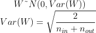
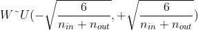
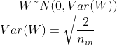
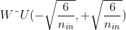
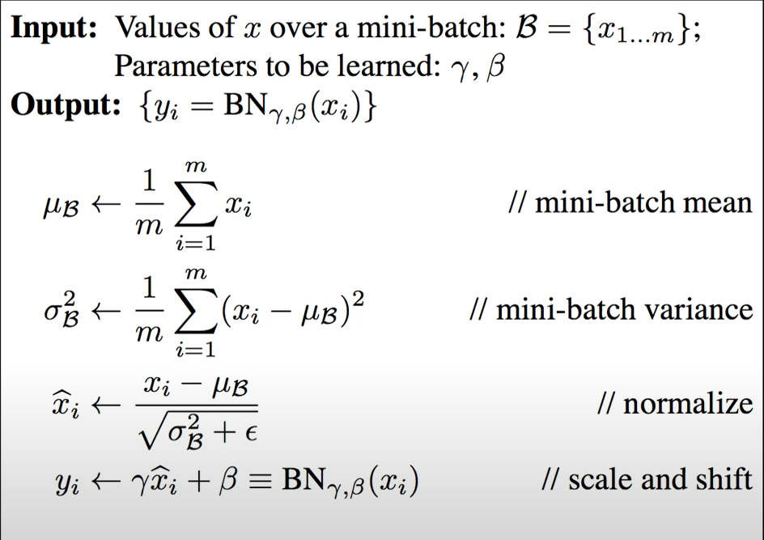

# Perceptron

- perceptron은 인공신경망의 한 종류이다.
- 입력 x가 들어왔을 때 가중치를 곱하고 가중치와 bais를 더하고 activation function을 거쳐 최종 결과를 출력한다.
- 초창기 linear classifier를 위해 만들어졌다.

---

### [Xor](https://github.com/xcvdv/deeplearning-basicstudy/blob/main/PART2/xor.ipynb)

한개의 층을 가지는 perceptron으로는 and와 or문제는 해결할 수 있지만 Xor문제를 해결할 수 없다. XOR문제를 해결하려면 hidden layer를 가지는 MLP가 필요하다. 또한 비선형성을 추가하기 위해 활성함수를 사용해야한다. 우선 nn.module을 사용하지않고, 아래처럼 gradient를 직접 구해 학습을 시켜보았다.

```python
    cost = -torch.mean(Y * torch.log(Y_pred) + (1 - Y) * torch.log(1 - Y_pred))
    
    # back propagation
    # cost를 미분 마지막 1e-7은 0으로 나누는것을 방지하기 위함
    d_Y_pred = (Y_pred - Y) / (Y_pred * (1.0 - Y_pred) + 1e-7)
    
    # layer2
    d_l2 = d_Y_pred * sigmoid_prime(l2)
    d_b2 = d_l2
    d_w2 = torch.matmul(torch.transpose(a1, 0, 1), d_b2)
    
    # layer1
    d_a1 = torch.matmul(d_b2, torch.transpose(w2, 0, 1))
    d_l1 = d_a1 * sigmoid_prime(l1)
    d_b1 = d_l1
    d_w1 = torch.matmul(torch.transpose(X, 0, 1), d_b1)
```

수식으로 직접 손으로 풀어보면 아래와 같다.


---

### [nn module](https://github.com/xcvdv/deeplearning-basicstudy/blob/main/PART2/xor_nn_module.ipynb)

pytorch의 nn.module을 사용해서 직접 Gradient식을 작성하지 않고 위와 똑같은 학습을 시킬 수 있다.

위의 코드들을 실행하다보면 W,b의 초기값에 따라서 결과가 크게 달라지는걸 알 수 있다.

초기값 선택이 매우 중요한듯하다

---

# ReLU

### sigmoid 문제점

학습 동작을 간단하게 생각해보면 활성함수를 취한 최종 output값의 Loss의 Gradient를 구해 backpropagation알고리즘을 사용해 파라미터를 업데이트하는 것이다.

Sigmoid의 문제점은 Gradient를 구할 때 발생한다.


위의 sigmoid함수의 모양을 보면 양 끝으로 갈 수 록 미분값이 굉장히 작아질 수 밖에 없다는것을 알 수 있다. 이렇게 미분값이 작아지게 되면 역전파 알고리즘이 수행될 때 뒷단에서 전달되는 Gradient가 소멸되는것 처럼 작동하게 된다(Vanishing Gradient).

---

### ReLU

ReLU의 그래프는 다음과 같다.


ReLU도 음수 영역에서는 음수로 activation이 될 경우 gradient가 사라지게 되는 문제점이 존재한다.

---

### optimizer

- torch.optim.SGD
- torch.optim.Adadelta
- torch.optim.Adagrad
- torch.optim.Adam
- torch.optim.SparseAdam
- torch.optim.Adamax
- torch.optim.ASGD
- torch.optim.LBFGS
- torch.optim.RMSprop
- torch.optim.Rprop

---

# Weight Initialization

### Weight

- weight를 어떻게 초기화 하느냐에 따라 성능이 크게 달라진다.

---

### RBM(Restricted Boltzmann Machine)

- RBM은 같은 layer의 노드끼리는 연결이 없고 다른 Layer와는 Fully Connected된 모델을 말한다.
- RBM을 사용해 Weight 초기화

    

    2개의 Layer를 RBM으로 학습하고(a) 다음 Layer를 추가시킨다. 

    Layer를 하나 추가하고 다시 RBM으로 학습하는 과정을 진행하는데 이전에 학습시킨 W1은 고정시킨 상태로 학습한다. 이렇게 RBM으로 모든 Layer의 W를 구해놓은 상태(초기화)로 전체 네트워크를 다시 학습 시킨다. 

    - **최근에 많이 사용되지는 않는다고 한다.**

---

### Xavier / He initialization

RBM처럼 복잡한 방식이 아닌 다양한 초기화 방법이 있다. Xavier와 He초기화 방법은 Layer의 특성에 따라 초기화를 해야한다는것에 토대를 두고 있다. ([공식 이해하기](https://ardino-lab.com/%EB%B0%9C%EC%A0%84%EB%90%9C-%EC%B4%88%EA%B8%B0%ED%99%94-%ED%95%A8%EC%88%98-xavier-he-%EA%B0%9C%EB%85%90-%EC%82%B4%ED%8E%B4%EB%B3%B4%EA%B8%B0/))

- Xavier
    1. Normal initialization

        

    2. Uniform initialization

        

    - 참고 : $n_{in}$은 Layer의 input수 $n_{out}$는 Layer의 output수를 의미한다.
- He initialization
    - He initialization은 Xavier의 변형으로 Layer의 output을 제거해준 식으로 초기화가 진행된다.
    1. Normal initialization

        

    2. Uniform initialization

        

- Sigmoid나 tanh같은 s자 활성함수를 사용할 경우 Xavier를 ReLU를 사용할 때에는 He초기화를 사용하면된다.

---

### pytorch code

```python
# xaiver_uniform_는 아래와 같이 작성되어 있다.
def xaiver_uniform_(tensor, gain=1):
	fan_in, fan_out = _calculate_fan_in_and_fan_out(tensor)
	std = gain * math.sqrt(2.0 / fan_in + fan_out))
	a = math.sqrt(3.0) * std 
	with torch.no_grad():
		return tensor.uniform_(-a,a)

# 사용
nn.init.xavier_uniform_(l1.weight)
```

---

### XOR문제 초기값을 변경해서 진행해보기

그냥 궁금해서 단순히 확인해 본것이지 반복회수가 적어 크게 의미는 없어보인다.

normal initialization을 사용하였을 경우 100번의 반복 학습 중 84번 accuracy가 1이 되었고,

uniform initialization을 사용하였을 경우 100번의 반복 학습 중 74번 accuracy가 1이 되었다.

다른 초기화를 거치지 않고 100번의 반복 학습중 71번 accuracy가 1이되었다.

— 진짜 의미가 없었다, 데이터 수가 적어 어쩔 수 없는듯하다.

---

# Dropout

- 학습을 진행하면서 각 Layer에 존재하는 노드들을 설정한 비율로 랜덤하게 사용하지 않는것을 말한다.
- Dropout은 Overfitting되지 않도록해준다.
- 학습을 할 때 Dropout하며 실제 Test할떄는 모든 노드를 사용한다.

---

### code

```python
linear1 = torch.nn.Linear(785, 512, bias = True)
linear2 = torch.nn.Linear(512, 512, bias = True)
linear3 = torch.nn.Linear(512, 512, bias = True)
linear4 = torch.nn.Linear(512, 512, bias = True)
linear5 = torch.nn.Linear(512, 10, bias = True)
relu = torch.nn.ReLU()
dropout = torch.nn.Dropout(p=drop_prob) # 

model = torch.nn.Sequentail(linear1, relu, dropout, 
                            linear2, relu, dropout, 
                            linear3, relu, dropout, 
                            linear4, relu, dropout,
                            linear5)
```

Dropout의 parameter는 몇퍼센트를 Dropout할지를 나타낸다.

---

### train, eval

- module을 training모드 혹은 evaluation모드로 설정한다.
- Dropout, BatchNorm등을 사용할지 안할지 결정해준다.

```python
model.train() # dropout을 설정한대로 사용하겠다. 

with torch.no_grad():
    model.eval() # dropout을 사용하지 않겠다.
```

---

# [Batch Normalization](https://github.com/xcvdv/deeplearning-basicstudy/blob/main/PART2/Batchnorm.ipynb)

### Gradient Vanishing/Exploding

- Gradient가 너무 작아져 소멸하거나, 너무 커지는 문제를 말한다.
- Gradient를 사용해 학습을 진행하기 때문에 이러한 문제는 학습에 큰 문제가된다.
- 이러한 문제는 활성함수를 바꾸거나, Weight초기값을 잘 설정하거나, 작은 learning rate를 사용하여 간접적으로 해결할 수 있다.
- 

---

### Internal Covariate Shift

- Batch Normalization을 사용하기 전 모델들은 input만 정규화 하였다. 그래서 input의 분포는 항상 비슷하게 유지되어 안정적으로 학습이 진행될 수 있었다.
- 하지만 각 hidden layer의 input은 학습이 진행됨에 따라 변하게된다.
- hidden layer의 input 분포가 계속 바뀌게되어 원활한 학습이 진행되지 않는다.
- Batch Normalization저자들은 이러한 문제를 Internal Covariate Shift(내부 공변량 변화)라고 하고, 해결하고자 Batch Normalization을 사용하였다.

---

### Batch Normalization

- Batch Normalization이란 Internal Covariate Shift를 해결하고자 각 Layer마다 Normalization을해서 분포를 조정하는것을 말한다.
- 보통 학습에서는 미니배치를 사용해 학습을 하기 때문에 각 미니배치마다 Normalization을 수행한다.



- scale과 shift를 적용하는 이유는 데이터를 계속해서 Normalize를 하게되면 활성함수의 nonlinearity같은 성질을 잃을 수 있는데 이를 완화시켜 주기 위함이다.
- 감마와, 베타는 학습을 통해 변화되는 parameter이다.
- evaluation을 할 때는 Batch Normalization을 하지 않는다.

    → 예를 들어 5개의 Batch가 있을 때 1234번은 똑같고 5번째 data가 다를경우 평균과, 분산이 달라 같은 입력에 다른 결과를 얻을 수 있기 때문이다.

- Evaluation을 할 때는 학습도중 구해진 평균, 분산(sample mean, sample variance)을 저장해 두고 이를 평균내어 고정된 평균과 분산으로 Normalization한다. (감마와 베타는 학습을 통해 정해진값을 사용)

---
