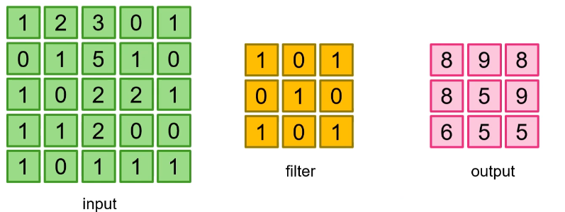
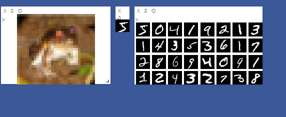
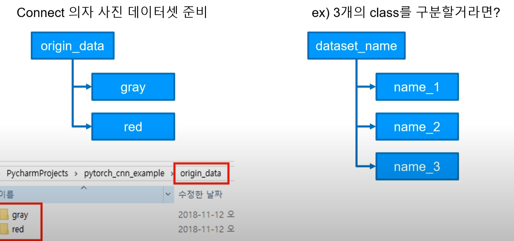

# Convolution

- 이미지 위에서 stride만큼 filter(kernel)을 이동시키면서 겹쳐지는 부분의 각 원소의 값을 곱하고 모든 곱한 결과를 더해서 출력하는 연산이다.



- stride : filter가 한번에 이동할 크기
- padding : input에 특정 값을 넣는것으로 output 크기를 조정할 때 사용한다.
- pytorch에서는 2D Convolution을 아래와 같이 지원해준다.

```python
torch.nn.Conv2d(in_channels, out_channels, kernel_size, strdie=1, padding=0, dilation=1, groups=1, bais=True)
```

- kernel_size는 (2,4)와 같이 만들 수 있으며 하나만 입력하면 n x n 크기의 filter가 생성된다.

---

### input shape

- N x C x H x W의 shape를 가져야하고, 이는 각각 batch size, channel, height, width를 말한다.

---

### pooling

- Max Pooling : 커널 사이즈 안에서 가장 큰 데이터만 추출한다.
- Average Pooling : 커널 사이즈 안에서 평균값을 추출한다.
- pytorch에서는 pooling을 아래와 같이 지원해준다.

```python
torch.nn.MaxPool2d(kernel_size, stride=None, padding=0, dilation=1, return_indices=False, ceil_mode=False)
```

# [MNIST CNN](https://github.com/xcvdv/deeplearning-basicstudy/blob/main/PART3/MNIST_Cnn.ipynb)

- 2개의 conv Layer를 가지는 model을 작성해 MNIST dataset을 학습시켜보기.
- Layer 1은 3 x 3 filter, stride는 1, padding은1, out channel은 32인 Convolution연산과, 2 x 2 filter를 사용한 maxpooling을 사용한다.
- Layer 2는 3 x 3 filter, stride는 1, padding은1, out channel은 64인 Convolution연산과, 2 x 2 filter를 사용한 maxpooling을 사용한다.

---

# [visdom, 실시간 loss그래프 보기](https://github.com/xcvdv/deeplearning-basicstudy/blob/main/PART3/Visdom_example.ipynb)

### visdom 설치 및 실행

visdom은 python의 시각화 도구중에 하나이다. 아래와 같이 설치하며 사용하기 위해 server를 실행해야한다.

서버를 실행하고 python코드로 visdom을 사용하면 브라우저로 다양한 그래프, 이미지 등을 볼 수 있다.

```python
# 설치
pip install visdom

# 서버 실행
python -m visdom.server
```



---

# [ImageFolder](https://github.com/xcvdv/deeplearning-basicstudy/blob/main/PART3/image_folder.ipynb)

- imageFolder를 사용해 직접 준비한 image들을 읽어오고, 학습에 필요한 형태로 변경할 수 있다.

### dataset 준비

아래의 그림처럼 class별로 나누어 데이터셋을 준비한다.



---

### ImageFolder

```python
train_data = torchvision.datasets.ImageFolder(root = "my_data/origin", transform = None)

for data,label in train_data:
    imshow(data)  # image확인
    break
```

root디렉토리의 하위 디렉토리별로 label이 0부터 차례대로 매겨진다.

---

### transforms

```python
trans = transforms.Compose([
    transforms.Resize((64, 128))
])
train_data = torchvision.datasets.ImageFolder(root = "my_data/origin", transform = trans)
```

위처럼 이미지를 조작하기위한 Resize, ToTensor, Garyscale등 다양한 transform을 Compose로 한번에 작성해서 이미지를 변경할 수 있다.

```python
data.save(f"my_data/trans_data/label/file_name.jpeg")
```

위의 코드로 변경한 데이터를 저장할 수 있다. 반복문을 돌면서 label과 index를 받아 적절한 디렉토리에 적절한 이름으로 저장해서 이후 다시 변경된 데이터를 사용할 때는 transforms을 다시 안해줘도 된다. 단 data.save의 경우 디렉토리가 모두 존재해야한다.

---

### model 저장, 불러오기

매번 이미지를 이런식으로 변환하기 싫다면 아래의 코드로 변환한 이미지를 저장할 수 있다.

```python
torch.save(net.state_dict(), "./model/model.pth")

new_net = CNN().to(device)
new_net.load_state_dict(torch.load("./model/model.pth"))
```