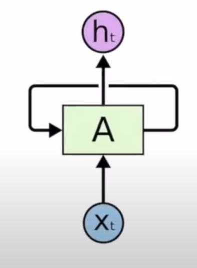
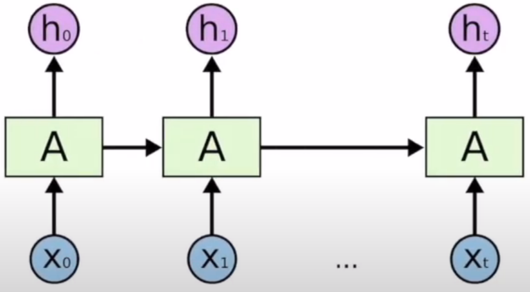
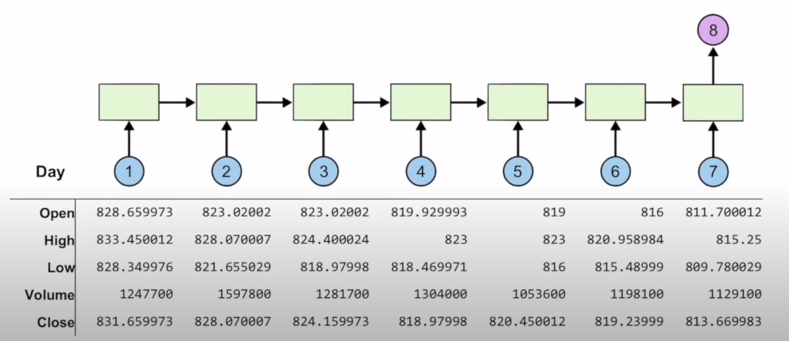
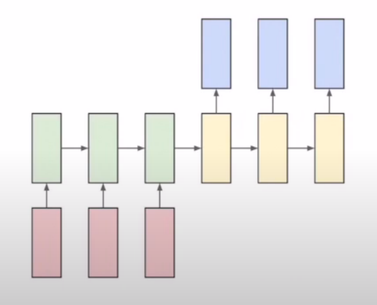
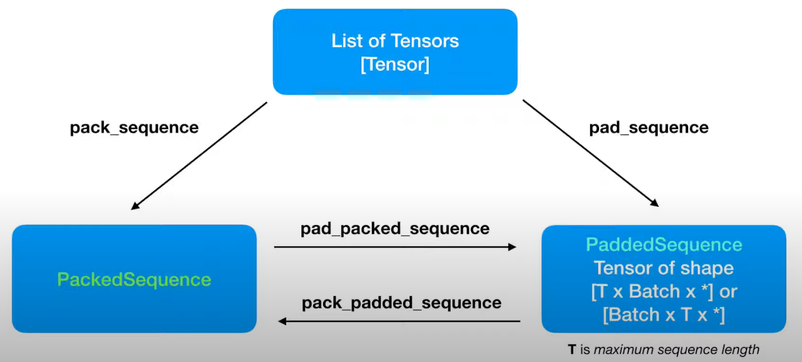

# PART 4: Recurrent Neural Network



- RNN은 sequential Data를 잘 다루기 위해 도입되었다.
- Sequential Data란 데이터의 값뿐만 아니라 데이터의 순서도 중요한 데이터이다.
- hidden state라는 이전 토큰들의 처리결과를 현재 처리하려는 토큰과 함께 사용하여 이전 토큰들의 처리결과를 고려하게 한다.
- 위의 RNN구조를 펼쳐보면 다음과 같이 생각할 수 있다.



---

### RNN in PyTorch

```python
rnn = torch.nn.RNN(input_size, hidden_size) # A
output, _status = rnn(input_data)
```

- input.shape은 (batch_size, sequence_length, input_size), output.shape는 (batch_size, sequence_length, hidden_size)가 된다.

---

# ["hihello"를 예측하는 예제](https://github.com/xcvdv/deeplearning-basicstudy/blob/main/PART4/hihello.ipynb)

- 각 문자들은 one-hot encoding하여 사용한다.

```python
char_set = ['h', 'i', 'e', 'l', 'o']
x_data = [[0, 1, 0, 2, 3, 3]] # hihell
x_one_hot = [[[1, 0, 0, 0, 0],
             [0, 1, 0, 0, 0],
             [1, 0, 0, 0, 0],
             [0, 0, 1, 0, 0],
             [0, 0, 0, 1, 0],
             [0, 0, 0, 1, 0]]]
y_data = [[1, 0, 2, 3, 3, 4]] # ihello
```

x의 경우 "hihell" , y의 경우 "ihello"로 작성되어 있는데 이는 "hihello"라는 고정된 문자열을 예측하는 모델이므로 마지막 'o'는 다음 글자가 없기 때문이다.

- cross entropy loss를 사용한다.

---

# [longseq example]((https://github.com/xcvdv/deeplearning-basicstudy/blob/main/PART4/longseq.ipynb))

- 긴 문장의 경우 hihello문제처럼 한번에 input으로 넣을 수 없다.
- 특정 input size의 window가 있다고 생각하고, 해당 window가 현재 포함하는 문자열을 X, window를 한칸 이동시켰을 때 포함하는 문자열을 Y로 해서 처리한다.
- predict결과를 문장으로 변경할 때 첫번째 결과 이외의 결과들은 마지막 하나의 index를 제외하면 모두 이전의 result와 겹치니 마지막 것만 추가해줘야 한다.

---

# [Time series Data example(Many to One)](https://github.com/xcvdv/deeplearning-basicstudy/blob/main/PART4/Time_series_Data.ipynb)



- 위의 그림처럼 최근 1주일의 주가 정보를 가지고 8일차 종가를 예측하는 모델을 만들어보자
- 최근 일주일의 정보만으로 다음날을 예측할 수 있다는 가정으로 모델 설계
- 거래량과, 다른 값들의 차이가 매우 크므로 모든 값들을 [0, 1]사이의 값으로 scaling한다.

---

# [sequence to sequence](https://github.com/xcvdv/deeplearning-basicstudy/blob/main/PART4/seq2seq.ipynb)



- seq2seq의 대표적인 예는 번역, Chatbot등이 있다.
- RNN과 다르게 Encoder를 사용해 input을 한번에 본 뒤 Decoder를 사용해 하나씩 output을 출력한다.

---

# packing, padding

- 길이가 다른 sequence data를 하나의 배치로 묶는 방법
- Text, Audio등 길이가 매번 달라지는 Sequence data가 많다.
- padding
    - 가장 길이가 긴 sequence data의 길이만큼 다른 data에 padding을 주어 batch_size x 가장긴 sequence 길이의 하나의 Tensor로 처리할 수 있다.
    - padding을 채워넣어 계산할 필요없는 뒷 부분을 계산해야하는 단점이 있다.
- packing
    - sequence의 길이를 저장하는 방식으로 사용한다.
    - pytorch에서 사용하기 위해서는 batch data를 길이 내림차순으로 정렬되어 있어야한다.

